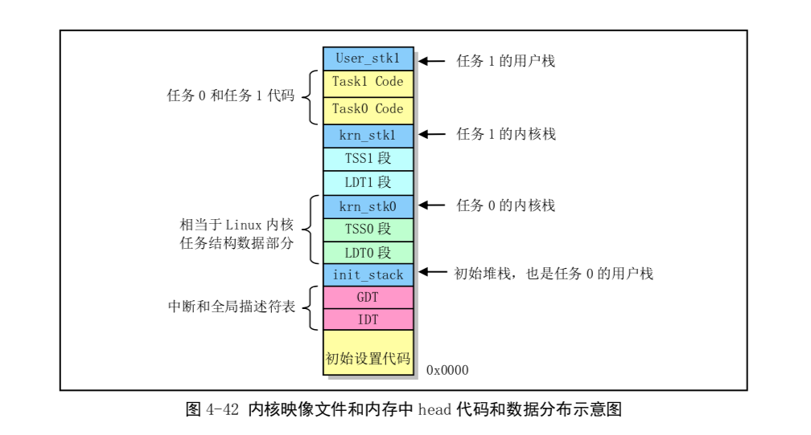

# 试验例子
注意使用 ubuntu 镜像，我用的 debian镜像会导致 objcopy 有 129MB。
```
# ubuntu 可编译
gcc (Ubuntu 9.3.0-17ubuntu1~20.04) 9.3.0
Copyright (C) 2019 Free Software Foundation, Inc.
This is free software; see the source for copying conditions.  There is NO
warranty; not even for MERCHANTABILITY or FITNESS FOR A PARTICULAR PURPOSE.

apt-install -y build-essential bin86

# debian 不可编译，objcopy 得到 128MB的 system
gcc (Debian 8.3.0-6) 8.3.0
Copyright (C) 2018 Free Software Foundation, Inc.
This is free software; see the source for copying conditions.  There is NO
warranty; not even for MERCHANTABILITY or FITNESS FOR A PARTICULAR PURPOSE.
```

```
sudo apt install bin86
```

1. 看下GDT和LDT中特权级，验证任务切换。猜测任务0的代码段、堆栈段还有初始堆栈。任务0 很特殊。


jnz: 如果 eflags 中 cf (carry flag)没有被置位。则跳转到对应地址。