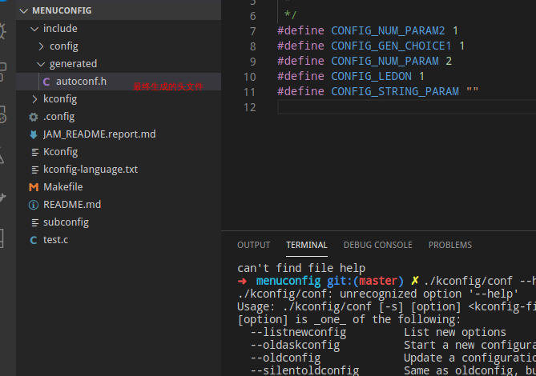

# 实验记录
时间: 20201205

# menuconfig 原理实验

教程地址
https://blog.csdn.net/qqliyunpeng/article/details/50858075

```
# 最后的编译物是 mconf 和 conf
cd kconfig
make

# 生成一个默认的配置
./kconfig/conf --oldconfig  Kconfig
# 或者是非交互的，前提是 .config 是已经存在 
./kconfig/conf --silentoldconfig  Kconfig

# 使用 gui 来配置 kconfig
./kconfig/mconf  Kconfig

# 清理
make clean
```
生成的头文件


帮助信息
```
./kconfig/conf: unrecognized option '--help'
Usage: ./kconfig/conf [-s] [option] <kconfig-file>
[option] is _one_ of the following:
  --listnewconfig         List new options
  --oldaskconfig          Start a new configuration using a line-oriented program
  --oldconfig             Update a configuration using a provided .config as base
  --silentoldconfig       Same as oldconfig, but quietly, additionally update deps
  --olddefconfig          Same as silentoldconfig but sets new symbols to their default value
  --oldnoconfig           An alias of olddefconfig
  --defconfig <file>      New config with default defined in <file>
  --savedefconfig <file>  Save the minimal current configuration to <file>
  --allnoconfig           New config where all options are answered with no
  --allyesconfig          New config where all options are answered with yes
  --allmodconfig          New config where all options are answered with mod
  --alldefconfig          New config with all symbols set to default
  --randconfig            New config with random answer to all options
```
