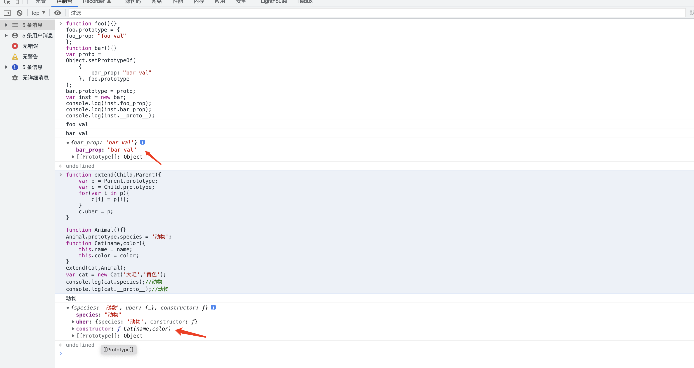
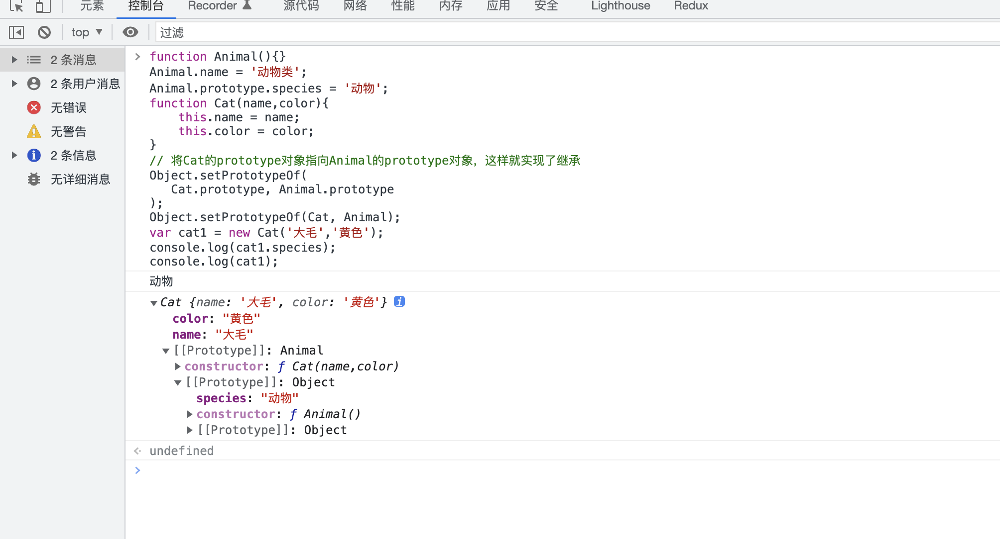

# net 模块源码分析

## 官方推荐的4种方式
https://developer.mozilla.org/zh-CN/docs/Web/JavaScript/Inheritance_and_the_prototype_chain#%E6%80%BB%E7%BB%93%EF%BC%9A4_%E4%B8%AA%E7%94%A8%E4%BA%8E%E6%8B%93%E5%B1%95%E5%8E%9F%E5%9E%8B%E9%93%BE%E7%9A%84%E6%96%B9%E6%B3%95

对于使用过基于类的语言 (如 Java 或 C++) 的开发者们来说，JavaScript 实在是有些令人困惑 —— JavaScript 是动态的，本身不提供一个 class 的实现。即便是在 ES2015/ES6 中引入了 class 关键字，但那也只是语法糖，JavaScript 仍然是基于原型的。
当谈到继承时，JavaScript 只有一种结构：对象。每个实例对象（object）都有一个私有属性（称之为 __proto__ ）指向它的构造函数的原型对象（prototype）。该原型对象也有一个自己的原型对象（__proto__），层层向上直到一个对象的原型对象为 null。根据定义，null 没有原型，并作为这个原型链中的最后一个环节。
几乎所有 JavaScript 中的对象都是位于原型链顶端的 Object 的实例。
尽管这种原型继承通常被认为是 JavaScript 的弱点之一，但是原型继承模型本身实际上比经典模型更强大。例如，在原型模型的基础上构建经典模型相当简单。
```
// 让我们从一个函数里创建一个对象o，它自身拥有属性a和b的：
let f = function () {
   this.a = 1;
   this.b = 2;
}
let o = new f(); // {a: 1, b: 2}
f.prototype.b = 3;
f.prototype.c = 4;

// 不要在 f 函数的原型上直接定义 f.prototype = {b:3,c:4};这样会直接打破原型链
// o.[[Prototype]] 有属性 b 和 c
//  (其实就是 o.__proto__ 或者 o.constructor.prototype)
// o.[[Prototype]].[[Prototype]] 是 Object.prototype.
// 最后o.[[Prototype]].[[Prototype]].[[Prototype]]是null
// 这就是原型链的末尾，即 null，
// 根据定义，null 就是没有 [[Prototype]]。

//////////////////////////////////////////////////
// 注意
//////////////////////////////////////////////////
对象 o.__proto__ 指向了构造函数的原型 o.constructor.prototype。也就是 f.prototype
```

Object.setPrototypeOf 和 Object.create 非常类似
```
// Object.setPrototypeOf
function foo(){}
foo.prototype = {
foo_prop: "foo val"
};
function bar(){}
// 相似的点
// var proto = Object.create(
//  foo.prototype,
//  {
//   bar_prop: {
//      value: "bar val"
//    }
//   }
// );
var proto = {
bar_prop: "bar val"
};
Object.setPrototypeOf(
proto, foo.prototype
);
bar.prototype = proto;
var inst = new bar;
console.log(inst.foo_prop);
console.log(inst.bar_prop);

// Object.create
function foo(){}
 foo.prototype = {
   foo_prop: "foo val"
 };
 function bar(){}
 var proto = Object.create(
   foo.prototype,
   {
     bar_prop: {
       value: "bar val"
     }
   }
 );
 bar.prototype = proto;
 var inst = new bar;
 console.log(inst.foo_prop);
 console.log(inst.bar_prop)
```


## constructor 什么时候存在
直接使用函数的 prototype 赋值时
```
function Animal(){}
Animal.prototype.species = '动物';
function Cat(name,color){
	this.name = name;
	this.color = color;
}
//将Cat的prototype对象指向Animal的prototype对象，这样就实现了继承
Cat.prototype = Animal.prototype;
Cat.prototype.constructor = Cat;

var cat1 = new Cat('大毛','黄色');
console.log(cat1.species);//动物
console.log(Animal.prototype.constructor)
```
利用空对象作为中介，防止 animal 的 prototype 也被修改
```
function Animal(){}
Animal.prototype.species = '动物';
function Cat(name,color){
	Animal.call(this);
	this.name = name;
	this.color = color;
}

//利用空对象作为中介，核心
var F = function(){};
F.prototype = Animal.prototype;
Cat.prototype = new F();
Cat.prototype.constructor = Cat;
console.log(Animal.prototype.constructor)
```
拷贝属性继承
```
function extend(Child,Parent){
	var p = Parent.prototype;
	var c = Child.prototype;
	for(var i in p){
		c[i] = p[i];
	}
	c.uber = p;
}

function Animal(){}
Animal.prototype.species = '动物';
function Cat(name,color){
	this.name = name;
	this.color = color;
}
extend(Cat,Animal);
var cat = new Cat('大毛','黄色');
console.log(cat.species);//动物
console.log(cat.__proto__);//动物
// console.log(Animal.prototype.constructor)
```
## constructor 什么时候不存在

```
function foo(){}
foo.prototype = {
foo_prop: "foo val"
};
function bar(){}
var proto = 
Object.setPrototypeOf(
    {
        bar_prop: "bar val"
    }, foo.prototype
);
bar.prototype = proto;
var inst = new bar;
console.log(inst.foo_prop);
console.log(inst.bar_prop);
console.log(inst.__proto__);
```


# 继承静态方法
```
function Animal(){}
Animal.name = '动物类';
Animal.prototype.species = '动物';
function Cat(name,color){
	this.name = name;
	this.color = color;
}
// 将Cat的prototype对象指向Animal的prototype对象，这样就实现了继承
Object.setPrototypeOf(
   Cat.prototype, Animal.prototype
);
Object.setPrototypeOf(Cat, Animal);
var cat1 = new Cat('大毛','黄色');
console.log(cat1.species);
console.log(cat1);
```

