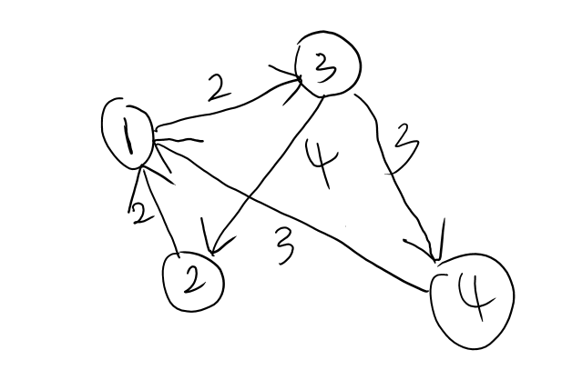

## COMP 3600/6466 Final Project Report

### Milestone - 1: Project Proposal

#### 综述:

本项目将实现 `Which Path to Go?` 程序, 它可以帮助人们找到两点之间的最短可通行路径, 算法将根据1.每条路径上所花费的时间, 2.该路径上是否有房间(结点)达到了最大容量, 导致无法通过. 算法的详细实现方案请看Assumption. 此外它还可以帮助人们在该图上建立费用最小的生成树, 可以为人们提供建立道路连通所有节点的解决方案.

#### **Assumptions:**

+ 房间/地点(节点)之间由路径(边)连通, 其中每条路径具有通行开销(例如通行时间, 通行花费).

+ 房间/地点达到最大容量后, 所有人不能通过该结点.

+ 每个人在出发时有一定的体力值(允许的最大开销), 如果所经过的路径花费的总开销大于此人出发时的开销, 该路径将被标记为非法(不允许这样通行).

+ 在查询最优路径的整个过程中, 区域中的人员数量不会改变. 在结束查询后, 人员数量是动态更新的. 

+ 默认计算开销总不超过`int32`范围, 且每次查询的最优解总是存在的.

+ 输入数据内容/格式包含: 房间/地点的位置信息, 即该房间与那些房间相连, 图结构信息; 每条路径(边, 点到点之间)的通行开销(例如通行时间, 通行花费); 房间/地点(节点)所能容纳的最大人数; 地图上的所有人员及他们的初始位置;

  可执行的查询指令: 在某时刻人员A想要到达地点I的最优路径; 生成全图开销最小的生成树.

#### **Functionalities:**

+ (标记, 将被计算分数的功能1): 该功能覆盖了Topic B.9.: MST+Dijkstra.

  该功能提供生成整个地图关于边开销最小的生成树, 为连通图的最小道路建设开销提供方案. 时间复杂度为 $\mathcal{O} (e \log(v))$, 其中$e$是边集大小, $v$是节点集大小.

+ (标记, 将被计算分数的功能2): 该功能覆盖了Topic B.8.: Dynamic Programming.

  该功能基于图上的生成树进行动态规划, 查找根节点到目的节点的最短路径, 充分利用树结构的无后效性, 树上DP. 时间复杂度为 $\mathcal{O}(e)$

+ (标记, 将被计算分数的功能3): 该功能覆盖了Topic B.4: Heap.

  该功能能快速找到前 $k$ 小开销的点到点路径, 为人们提供更多选择. 时间复杂度为 $\mathcal{O} (k \log(v))$.

+ I/O: 输入数据与查询, 程序建立数据结构并执行算法, 输出当前地图信息与查询结果. 查询可以动态循环多次.

+ 动态更新图的各种信息, 包括节点人数, 通行方案等.

#### M1 反馈

+ 功能 is very vague?

  我们更倾向于建造一个查询路径工具 - 在特定应用场景下, 提供给客户一定的寻路方案, 比如客户希望尽快找到最近的停车场, 这里结点容量对应着停车场内车的数量, 路径上的开销对应着拥堵程度(时间开销), 客户出发时的体力值对应在多少时间内必须到达停车场.

+ 功能2和功能3似乎是相同的?

  并不是, 功能2基于功能1的最小生成树构建, 即需要构建出MST后才能执行, 是近似解(当前MST上的最优解).

  而功能3基于功能1的Dijkstra算法, 不需要最小生成树, 是全局最优解.


### Milestone - 2: Design Document

#### 1 A confirmation and refinement of the software application you will develop. & 2 A confirmation of at least two functionalities you will implement.

我对Milestone1中的三个功能进行确认.

#### 3 The exact algorithm/data structure and Arguments

##### 功能 1 Kruskal MST 详细数据结构说明:

---

数组的实现都是用STL中 `vector` 存储. 输入数据从文件读入, 以下功能已实现, 详细请见代码.

+ 图结构存储: 链式前向星.

  > **链式前向星**是一种用于存储图的数据结构，一般认为是由Jason911发明的。链式前向星采用了邻接表的思想，本质上就是用链表实现的邻接表。可以使用数组模拟链表，定义head,to,nxt,edge数组，其中长度为n的head数组表示从每个节点出发的第一条边在to和edge数组中的位置，长度为m的to和edge是一一对应的，分别记录每条边的终点与边权（对于无权图，edge数组可省略），长度也为m的nxt数组模拟了链表指针，表示从相同节点出发的下一条边在to和edge数组中的位置。因此，链式前向星的空间复杂度为 $\mathcal{O}(n+m)$.
  >
  > 来自中文维基: https://zh.wikipedia.org/wiki/%E9%93%BE%E5%BC%8F%E5%89%8D%E5%90%91%E6%98%9F

  定义数据结构如下:

  ```c++
  struct Edge {
  	int id;
  	int u, v, w;
  	int to, nex;
  };
  
  class Graph {
  public:
  	Graph() { }
  	Graph(string inputFileName = "") {
  		// 读取数据...
  		// 初始化数据结构...
  	}
  	int find(int x) {
  		// 并查集 find 操作...
  	}
  	int n, m;
  	vector<int> fa;
  	vector<Edge> edge;
  
  private:
  	string inputFileName;
  };
  ```

+ Kruskal算法数据结构:

  + 并查集 (自己实现的, 并非调用STL库):

    使用树形结构实现并查集, 初始化时每个结点自成一类, 即对应图中没有任何边连成生成树.

    当有边被加入生成树(例如边 $a, b$ 相连), 则对应并查集的树形数据结构, $a$ 的父亲结点 连接到 $b$ 的父亲结点(并查集的union操作), 请注意这里采用了路径压缩, 即限制每棵树的深度小于2, 这可以大幅提高并查集find操作效率.

  + 结果数组:

    存有当前MST结果.

##### 功能 2 Dijkstra 最短路 详细数据结构说明:

---

使用了 **heap** 数据结构.

+ 以下是**结合堆(数据结构)的Dijkstra的原理**, 详见代码`Dijkstra class` 的实现.

  算法使用了广度优先搜索解决赋权有向图或者无向图的单源最短路径问题, 算法最终得到一个最短路径树.
  
  Dijkstra算法采用的是一种贪心的策略, 声明一个数组dst来保存源点到各个顶点的最短距离和一个保存已经找到了最短路径的顶点的集合: $T$, 初始时源点 s 的路径权重被赋为 0 (dis[s] = 0).
  
  若对于顶点 s 存在能直接到达的边 (s, m), 则把dst[m]设为 cost(s, m), 同时把所有其他（s不能直接到达的）顶点的路径长度设为无穷大. 初始时集合T只有顶点s.
  
  接下来从dst数组选择最小值, 则该值就是源点s到该值对应的顶点的最短路径, 并且把该点加入到T中, 此时完成一个顶点.
  
  我们需要看看新加入的顶点是否可以到达其他顶点并且看看通过该顶点到达其他点的路径长度是否比源点直接到达短, 如果是, 那么就替换这些顶点在dis中的值.
  
  如此往复从dst中找出最小值, 重复上述动作, 直到 $T$ 中包含了图的所有顶点.
  
  如上不断找出数组中的最小值的操作, 我们始终借助 堆 数据结构的结构特性.

##### 功能 3 Heap 找到排名前几的最短路径 详细数据结构说明:

堆(heap)又被为优先队列(priority queue), 在队列中, 我们可以进行的限定操作是dequeue和enqueue. dequeue是按照进入队列的先后顺序来取出元素, 而在堆中, 我们不是按照元素进入队列的先后顺序取出元素的, 而是按照元素的优先级取出元素.

在该问题中优先级就是到该节点路径的开销.

堆的实现

+ 在形式上是完全二叉树(complete binary tree), 这样实现的堆成为二叉堆(binary heap): 完全二叉树是增加了限定条件的二叉树. 假设一个二叉树的深度为n. 为了满足完全二叉树的要求, 该二叉树的前n-1层必须填满, 第n层也必须按照从左到右的顺序被填满.

+ 在物理(代码实现)上是紧密排列的数组, 更新堆代码如下:

  ```python
  void heapify(int n, int i) {
  	int largest = i;
  	int l = 2 * i + 1; // left = 2*i + 1
  	int r = 2 * i + 2; // right = 2*i + 2
  
  	if (l < n && nodeVec[l].cost > nodeVec[largest].cost)
  		largest = l;
  
  	if (r < n && nodeVec[r].cost > nodeVec[largest].cost)
  		largest = r;
  	if (largest != i) {
  		swap(i, largest);
  		heapify(n, largest);
  	}
  }
  ```

#### 类设计说明


#### 测试用例说明


如上测试用例, 输入格式为:

```
n, m
x_1, y_1, w_1
接下来m - 1行...

n: 结点数量, m: 边数量.

如上测试用例为:
4 5
2 1 2
1 3 2
4 1 3
3 2 4
3 4 3
```

程序输出: 

+ MST输出以 <id, u, v, weight> 格式.
+ 最短路输出以 4 号结点为源点, 输出到达其他所有节点的最短路.

容易验证程序是正确的.


## 注意:

运行时程序**从 `t.in` 文件中** 标准流形式读入数据, 请按照格式在`t.in`内放置数据.




