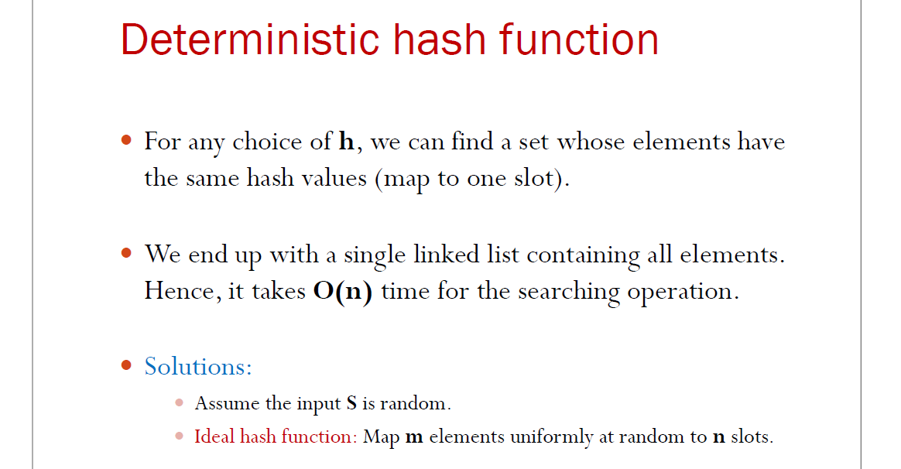
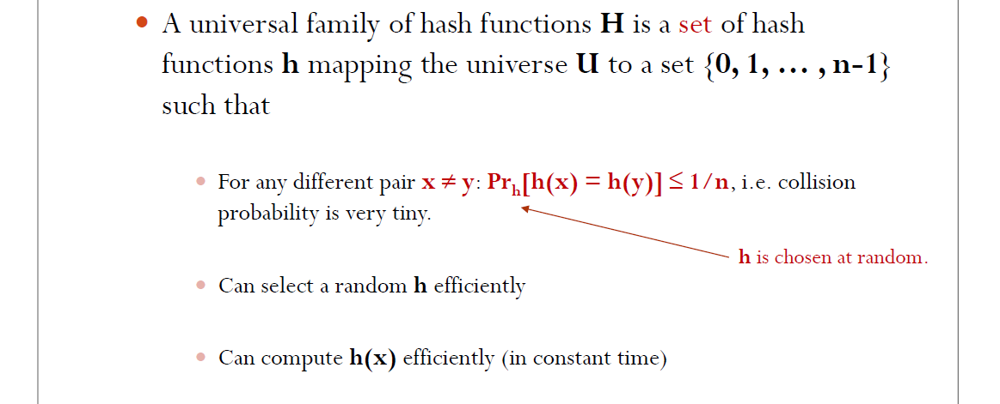
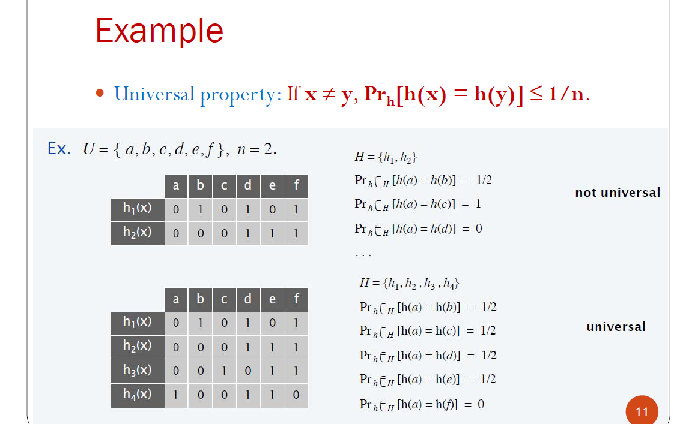
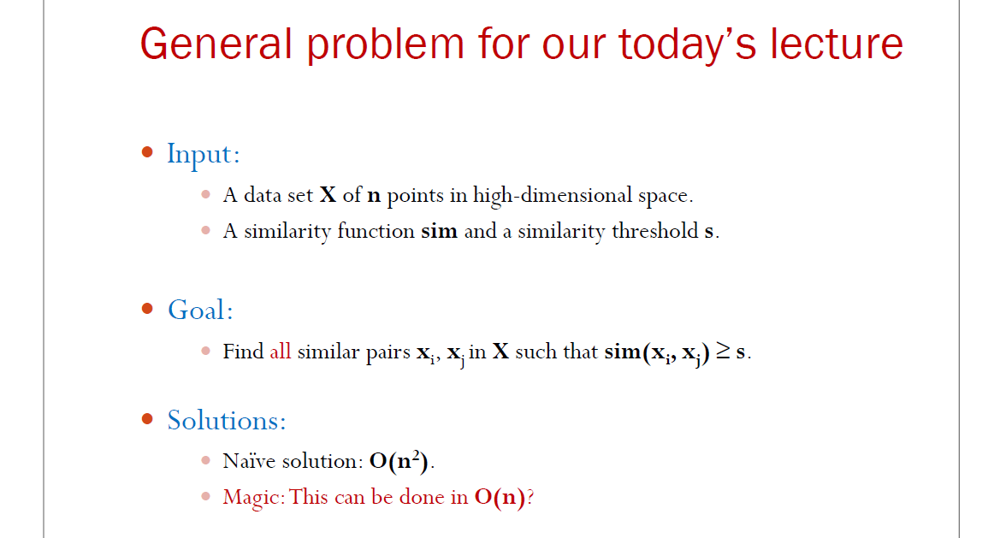
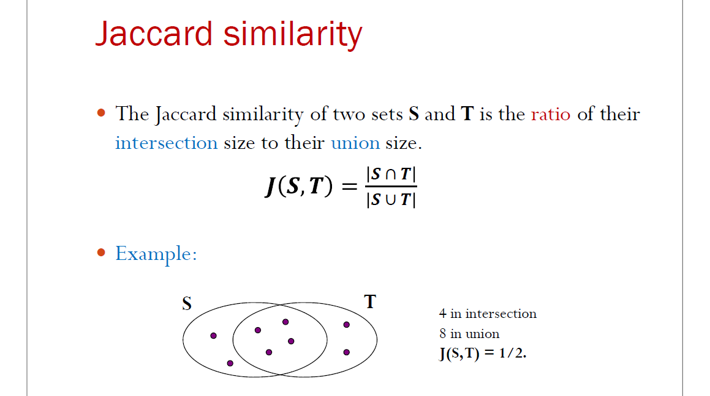
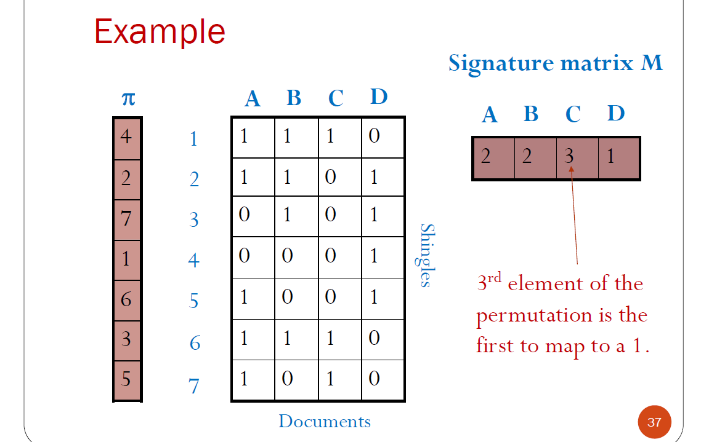
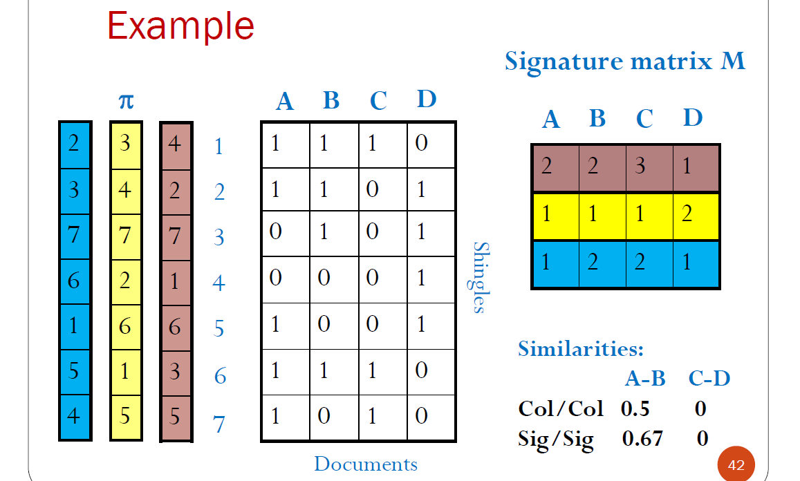
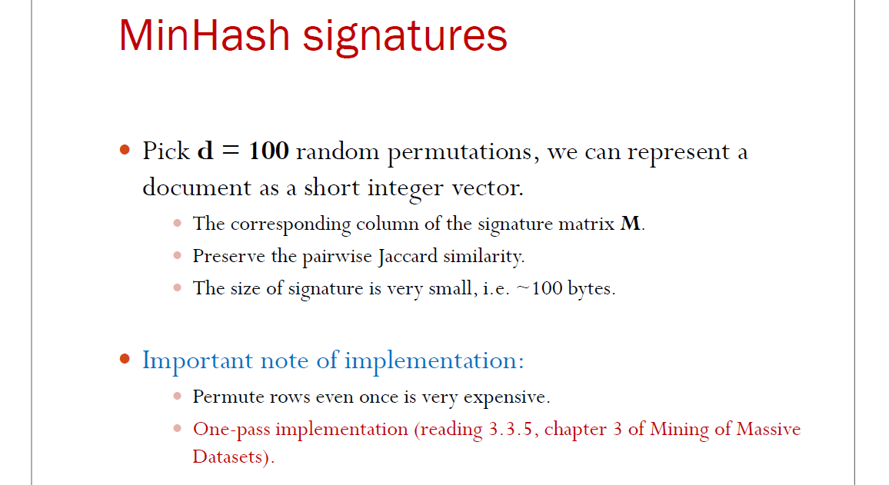

固定的哈希函数: 

对于哈希函数 $h$ 的任何选择, 我们都可以找到一个具有相同哈希值的集合(映射到同一个槽), 所以最坏情况就是搜索操作需要 $\mathcal{O}(n)$ 时间. 解决如上不均衡问题: 假设输入 $S$ 是随机的, 理想哈希函数会均匀随机映射$m$个元素到$n$个槽.

**A universal family of hash functions**, 一族函数, hash的时候选择一个映射. 需要满足的特性, 请注意这里是相等的$h$占所有$h$的比例:  

### MinHash

Jaccard similarity: 

在Jaccard相似性度量下, 定义 $h_{min}(S)$ 为集合$S$中具有最小$h(x)$的元素$x$, 我们有:
$$
Pr \{ h_{min} (S) = h_{min} (T)\} = \mathcal{J}(S, T) \\ \text{where} \ \ h_{min}=\arg \min(\pi(S))
$$

MinHash 结合例子理解: 

如上图, 左边 $\pi$ 是一个映射/排列. 依据这个排列组成的矩阵为:

| 4 (该列是原文本) | 0    | 0    | 0    | 1    |
| ---------------- | ---- | ---- | ---- | ---- |
| 2                | 1    | 1    | 0    | 1    |
| 6                | 1    | 1    | 1    | 0    |
| 1                | 1    | 1    | 1    | 0    |
| 7                | 1    | 0    | 1    | 0    |
| 5                | 1    | 0    | 0    | 1    |
| 3                | 0    | 1    | 0    | 1    |

上面的矩阵右边每列就是 A, B, C, D, 每列第一个1出现的下标(从1开始)填到上图右边即可.

当然还要生成多种 $\pi$: 

生成100个$\pi$: 

### 数据集描述

`docword.kos`: 文档数: 3430, 单词数: 6906, 总词量: 353160

