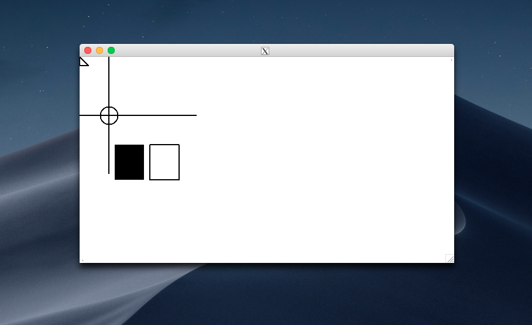

# x11 原理
## x11 是什么
X窗口系统（X Window System，也常称为X11或X，天窗口系统）是一种以位图方式显示的软件窗口系统。最初是1984年麻省理工学院的研究，之后变成UNIX、类UNIX、以及OpenVMS等操作系统所一致适用的标准化软件工具包及显示架构的运作协议。X窗口系统通过软件工具及架构协议来创建操作系统所用的图形用户界面，此后则逐渐扩展适用到各形各色的其他操作系统上。现在几乎所有的操作系统都能支持与使用X。更重要的是，今日知名的桌面环境——GNOME和KDE也都是以X窗口系统为基础建构成的。

x11 转发是转发xlib调用的接口内容到 xserver. 以前有一种 xterml （x 终端机）仅仅装 xserver的。

## 验证实验
- 实验一: 转发一个画方形的程序

### 实验一
转发一个画方形的程序。参考: https://github.com/QMonkey/Xlib-demo/blob/master/src/simple-drawing.c

```
sudo apt install libx11-dev
gcc -lX11 simple-drawing.c -o simple-drawing

# ssh 用户是谁，就要在谁下面执行图形化程序
ssh -X -vvv  ics@127.0.0.1 -p 2223
export DISPLAY=192.168.131.203:10.0
```
仅仅装了 libx11-dev 就有下面的效果


调错图


https://www.cyberciti.biz/faq/x11-connection-rejected-because-of-wrong-authentication/
